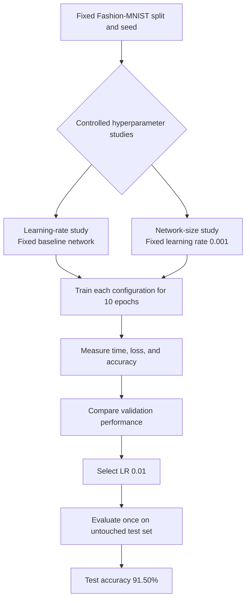
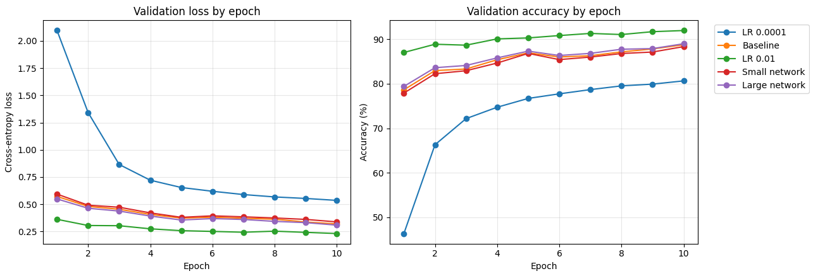

# REU Assignment 1

**Author:** Akbar Aman

**Date:** 6/19/26

## Overview

I investigated how learning rate and network size affected convolutional neural network performance on Fashion-MNIST. I compared each configuration using training and validation time, cross-entropy loss, accuracy, parameter count, and the train-validation accuracy gap.

## Experimental design

I used a fixed 50,000/10,000 train-validation split and retained the original 10,000-image test set for final evaluation. Each model was trained for 10 epochs using SGD with momentum. The learning-rate study tested `0.0001`, `0.001`, and `0.01` with a fixed baseline architecture. The network-size study tested `(16, 32, 64)`, `(32, 64, 128)`, and `(64, 128, 256)` with a fixed learning rate of `0.001`.

## Results

| Configuration | Learning rate | Network size | Parameters | Train time (s) | Train loss | Train accuracy | Validation time (s) | Validation loss | Validation accuracy | Gap (pp) |
|---|---:|---|---:|---:|---:|---:|---:|---:|---:|---:|
| LR 0.0001 | 0.0001 | (32, 64, 128) | 421,642 | 123.02 | 0.5239 | 81.35% | 20.956 | 0.5356 | 80.65% | 0.70 |
| Baseline | 0.001 | (32, 64, 128) | 421,642 | 114.97 | 0.2969 | 89.49% | 18.209 | 0.3196 | 88.77% | 0.72 |
| LR 0.01 | 0.01 | (32, 64, 128) | 421,642 | 115.31 | 0.1206 | 95.60% | 17.993 | 0.2314 | 91.96% | 3.64 |
| Small network | 0.001 | (16, 32, 64) | 105,866 | 115.24 | 0.3153 | 88.69% | 19.906 | 0.3381 | 88.35% | 0.34 |
| Large network | 0.001 | (64, 128, 256) | 1,682,954 | 116.98 | 0.2817 | 90.00% | 18.454 | 0.3084 | 88.99% | 1.01 |

## Interpretation

### Learning rate

The best tested learning rate was `0.01`, which achieved 91.96% validation accuracy and 0.2314 validation loss. Increasing the learning rate from `0.0001` to `0.01` improved final validation accuracy by 11.31 percentage points within the fixed 10-epoch budget. The `0.0001` model was still improving at epoch 10, indicating that it converged too slowly for the allotted training period. The `0.01` model converged fastest and produced the lowest loss, although its 3.64-point train-validation gap was larger than the gaps at the lower learning rates. Training-time differences among these identically sized models were treated as runtime variation rather than an effect of learning rate.

### Network size

At the fixed learning rate of `0.001`, the large network achieved the highest validation accuracy at 88.99%. The small, baseline, and large models achieved 88.35%, 88.77%, and 88.99%, respectively. Increasing capacity from 105,866 to 1,682,954 parameters therefore improved validation accuracy by only 0.64 percentage points. The corresponding generalization gap increased from 0.34 to 1.01 percentage points. These results showed diminishing returns from additional capacity and modest evidence of increased overfitting. Measured training times remained similar on the T4 GPU, ranging from 114.97 to 116.98 seconds.

### Final model

Validation accuracy selected the `LR 0.01` configuration. On the untouched test set, this model achieved 91.50% accuracy and 0.2516 loss in 1.783 seconds. Test accuracy was 0.46 percentage points below validation accuracy, indicating that the selected model generalized consistently to held-out data.

## Conclusion

The experiment showed that learning rate had a greater effect on model performance than network size within the fixed 10-epoch budget. Increasing the learning rate from `0.0001` to `0.01` improved validation accuracy from 80.65% to 91.96% and reduced validation loss from 0.5356 to 0.2314, demonstrating substantially faster convergence, although the 3.64-point train-validation gap indicated increased overfitting. Increasing network size from 105,866 to 1,682,954 parameters improved validation accuracy by only 0.64 percentage points, from 88.35% to 88.99%, while increasing the generalization gap from 0.34 to 1.01 percentage points. Training times remained similar across network sizes on the T4 GPU, so the additional capacity produced only a marginal performance benefit under these conditions. Overall, the `0.01` learning-rate configuration provided the strongest balance among convergence, validation loss, and accuracy, and its 91.50% test accuracy confirmed that the selected model generalized effectively to unseen data.

## Reproducibility

The complete implementation is available in [REU_Assignment_1.ipynb](REU_Assignment_1.ipynb). The [executed notebook is also available through Google Drive](https://drive.google.com/file/d/12cZhHtWGHarQ5Y1nrybc7SScpvY1sjuT/view?usp=sharing). I executed the experiment in Google Colab using a T4 GPU and a fixed random seed of `1024`. All configurations were evaluated in the same runtime session. The retained console output is available in [results/output.txt](results/output.txt), and the summary table is preserved in [results/tablese.png](results/tablese.png).
